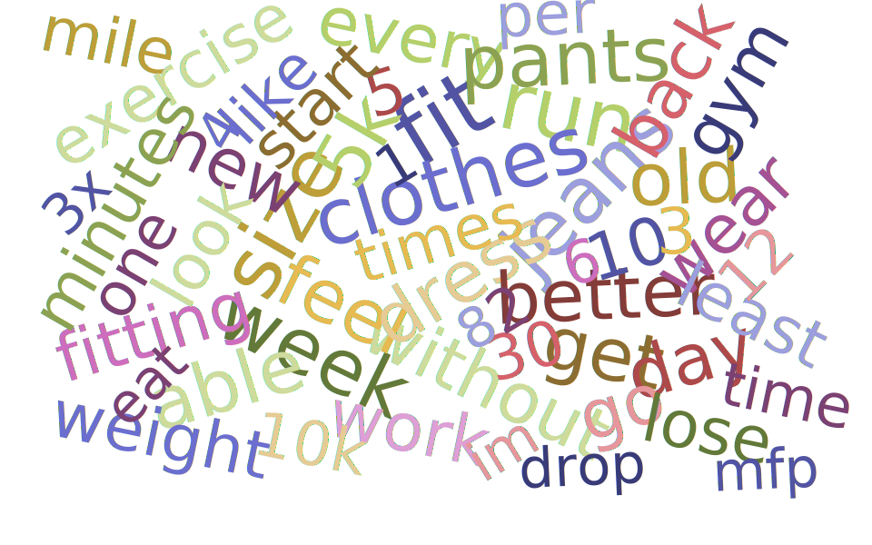

# Loseit Weight Loss Challenge Analysis

*Word cloud showing the 100 most common words people use when describe their motivation for losing weight not related to the number on a scale.

## Background

Multiple times throughout the year the subreddit [r/loseit](https://www.reddit.com/r/loseit) organizes weight loss competitions as a way to motivate the community members during their attempts at losing, maintaining, or even sometimes gaining weight. These challenges last between 6 and 10 weeks and pit teams of people to compete against each other to see who can lose the most weight during the challenge. I wanted to analyze the data from previous challenges to see how successful people were at reaching their goals during these challenges.

## Methods and Tools

During challenge signups, participants enter information about relating to their current and past weight and what they would like to achieve during the competition both related to the amount they want their weight to change, as well as information about some of the motivations they have for losing weight. After signing up, participants are randomly assigned to a team that they will be a part of for the duration of the challenge. Each week participants enter their current weight into the global spreadsheet. It is these spreadsheets that I wanted to use in my analysis.

Using the Reddit API library PRAW, I queried the last 1,000 posts on r/loseit for the keyword "loseit challenge tracker" to find Google Sheets urls. After narrowing the urls down to just the links to challenge trackers, I used gspread the Google Sheets API library to open and download the spreadsheets into a Pandas DataFrame. With the data in python, I needed to do some cleaning to make the column names consistent across all of the challenges as they used slightly different templates depending on the person moderating the challenge.

With all of the challenge data in python, I went through to try and fill in some of the missing or inconsistent information entered. Some entries I was able to replace or fill in the correct data using relevant information such as a different challenge they participated in. Also, for the challenges I analyzed, people were dropped from the competition if they missed two consecutive weigh-ins. To account for dropout from the competition, I removed all participants who missed the final weigh-in for their challenge unless they had an entry for the prior week. In these cases, I used the prior week's weigh-in as their final weight. Because of the variable challenge lengths, I only kept starting and final weigh-in to calculate the amount of weight lost during the challenges. Doing some simple exploration through some of the features, it was clear that there were instances of information being entered incorrectly into the spreadsheet. For categories like weight lost during the challenge, I tried to set reasonable upper and lower bounds of what I would keep when doing analysis.

With the data mostly cleaned except for some outliers, I proceded in using Seaborn and Matplotlib to create visualizations showing some of the more interesting findings from the data. 

## Findings

## How to Use the Code

To run the code that fetches and downloads the challenge trackers from r/loseit and Google Sheets, you will need to have access tokens for both Reddit and Google. Instructions for how to set up and access Reddit through PRAW can be found [here](https://github.com/reddit-archive/reddit/wiki/OAuth2). Note that you will need to be signed into a reddit account to follow the instructions and create an app. After registering your new app, you will need to have your access tokens available for python to read. An example of that this may look like is included in the `notebooks` folder, but remember that you should ***never commit access credentials*** to a GitHub repository, even if it is private. To get access to Google Sheets, you can follow the instructions [here](https://gspread.readthedocs.io/en/latest/oauth2.html) on how to register an app with Google. Again I have included an example of what the credential file might look like in the `notebooks` folder, but again remember this is just an example and you should never commit secrets to a GitHub repository. If you don't want to go through the hassle of setting up access to Google and Reddit, I've included both the raw challenge tracking and final cleaned data frames used for the analysis in the form of CSV files located in the data folder.

